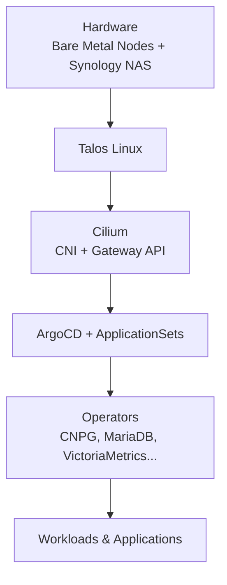

# Architecture

This page gives a high-level overview of how the different parts of this Kubernetes cluster fit together. The goal is to help you understand the main architectural choices without going into every technical detail.

## High-level Layers

The cluster can be seen as several layers, from the physical infrastructure up to the applications:

## Key Architectural Decisions

### 1. Exposure Model (LAN vs Public)

- **LAN only**: All services exposed on `*.menia.cc` are only reachable from the local network. They use the Cilium Gateway API + certificates from cert-manager (Let's Encrypt).
- **Public access**: Any service that needs to be reachable from the internet goes exclusively through **Cloudflare Tunnels**. Cloudflare handles TLS termination and provides additional security (WAF, DDoS protection, etc.).

This clear separation is intentional: internal services stay on the LAN, while only selected applications are opened to the public via Cloudflare.

### 2. Storage Strategy

Two different storage systems are used:

- **Longhorn**: Primary storage. Used for most workloads that need good performance and Kubernetes-native volume management.
- **Synology CSI**: Secondary storage, backed by the home NAS. This is slower (network storage) and is intended for workloads with low I/O requirements (media, backups, archives, downloads, etc.).

Using two storage backends allows balancing performance needs with large capacity and snapshot/backup capabilities from the NAS.

### 3. GitOps with ArgoCD

Everything is managed declaratively through Git:

- ArgoCD continuously reconciles the desired state defined in this repository.
- ApplicationSets automatically discover applications in the `apps/`, `core/`, and `operators/` directories.
- No manual `kubectl apply` in production — changes go through Git.

### 4. Secrets Management

Sensitive data is never stored in plain text:

- All secrets are encrypted at rest using **SOPS + age**.
- Decryption during deployment is handled by **KSOPS** (a Kustomize plugin).
- The same mechanism is used both locally and inside ArgoCD.

## How to Explore the Project

Here are some common paths depending on what you want to understand:

| If you want to understand...                  | Start here |
|-----------------------------------------------|------------|
| How the cluster is bootstrapped               | [Getting Started / Installation](Getting%20Started/installation.md) |
| How applications are exposed to the internet  | [Networking & Exposure / Cloudflared](Core%20Concepts/Networking%20&%20Exposure/cloudflared.md) |
| How internal services get TLS on the LAN      | [Networking & Exposure / cert-manager](Core%20Concepts/Networking%20&%20Exposure/cert-manager.md) |
| How storage is organized                      | [Storage](Core%20Concepts/Storage/longhorn.md) (Longhorn primary + Synology CSI) |
| How GitOps is set up                          | [GitOps / ArgoCD](Core%20Concepts/GitOps/argocd.md) |
| How operators are managed                     | [Operators](Operators/operators.md) |
| How secrets are handled                       | [Security / Encryption](Core%20Concepts/Security/encryption.md) |

## Summary

This setup prioritizes:

- Clear separation between internal (LAN) and public access
- Pragmatic storage choices (performance vs capacity)
- Strong GitOps practices
- Secure secret management from day one

The project is intentionally not trying to be minimal or "the simplest possible". It reflects real-world trade-offs for a home lab that also hosts some public services.
