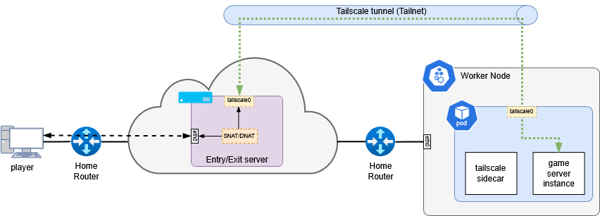

# External Access (UDP & Non-HTTP)

This page describes methods for accessing services from outside the local network, with a focus on non-HTTP / UDP workloads (mainly games).

## Public HTTPS access

Public access over HTTPS is handled exclusively through Cloudflare Tunnels using the Cloudflare Tunnel Ingress Controller.

See [Cloudflared](cloudflared.md) for technical details on how public exposure is configured.

## UDP access

Some services (mainly games) require UDP access. For these, two solutions are used:

### Tailscale

A Tailscale exit node (running on a VPS) is used to expose UDP ports.

This is required for games like Core Keeper that only support joining via a "Game ID" and not via direct IP/port.

- A VPS is rented (OVH, Hetzner, etc.) to act as the exit node.
- Friends connect through this exit node.

### Playit.gg

For games that support direct IP/port but still use UDP, [playit.gg](https://playit.gg/) is used.

It is simpler because it handles the network/VPN part automatically, including the entrypoint.

Examples of this setup can be found in `examples/apps/core-keeper/`.
