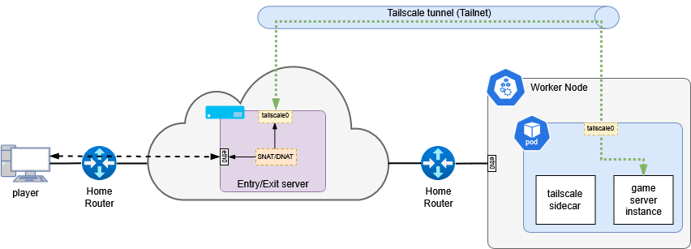

# Tunnel

## Public access

### Regular HTTPS access

As my network will allow local area network access by default, I've setup a [Cloudflare Tunnel](https://developers.cloudflare.com/cloudflare-one/connections/connect-apps/install-and-setup/tunnel-guide) to allow public access to selected apps. Cloudflare will hide my IP and it's enabled CDN (proxy) that includes several security features like WAF, DDoS protection, etc.

### UDP access

I use a [Tailscale](https://tailscale.com/) tunnel to be able to access UDP ports from the outside, using a remote server (VPS for example) as entrypoint and exit node; the exit node part is required for example with games like Core Keeper that only allows to join the game using a "Game ID" and it's not possible to join using an IP and port.
For games allowing access using IP/dns and port but still in UDP, I use [playit.gg](https://playit.gg/). There is examples available in `available/apps/core-keeper` folder.

#### Tailscale

I had to rent a VPS from OVH / Hetzner / ExtraVM / LowHosting for example so I can use it as entry and exit node. Then simply share IP to my friends, or for Core Keeper the Game ID.
Here is a schema of the infrastructure. Thanks to my good friend Loïc for the drawing.

#### Playit

More straightforward as they handle all the network / VPN part for us including entrypoint.