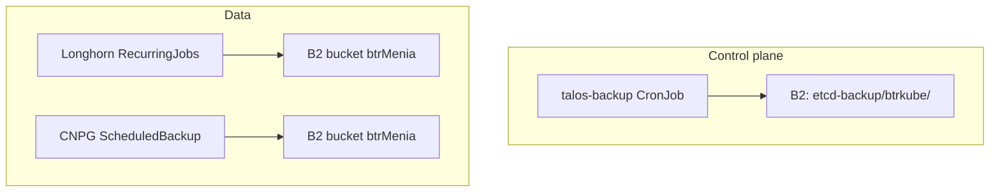

# Backup

This cluster uses a layered backup strategy. Each layer covers a different failure mode.

## Overview

| Layer | What is backed up | Mechanism | Destination |
|-------|-------------------|-----------|-------------|
| **etcd** | Full Kubernetes control-plane state | [talos-backup](https://github.com/siderolabs/talos-backup) CronJob | `s3://btrMenia/etcd-backup/btrkube/` |
| **PVC data** | Application persistent volumes (opt-in) | Longhorn RecurringJobs | Backblaze B2 (via Longhorn backup target) |
| **Postgres** | CNPG database dumps (per app) | Barman Cloud `ScheduledBackup` | `s3://btrMenia/<app>-postgres-backup/` |

Git remains the source of truth for manifests. etcd backups complement GitOps by capturing live cluster state (in-cluster secrets, CR status, etc.).



## etcd backup (talos-backup)

Component: `core/talos-backup/` (ArgoCD Application `talos-backup`).

### Prerequisites

1. **Talos machine config** — control planes must expose the Talos API to the `talos-backup` namespace with role `os:etcd:backup` (`kubernetesTalosAPIAccess` in `infra/controlplane.enc.yaml`).
2. **age keypair** — dedicated to etcd backups (separate from the SOPS age key used for git secrets).
   ```bash
   age-keygen -o talos-etcd-backup.age
   ```
   - Store the **private key** offline (password manager, safe). Required only for disaster recovery.
   - Put the **public key** (`age1...`) in `core/talos-backup/secret.enc.yaml` via `sops`.
3. **Backblaze B2** — bucket `btrMenia`, prefix `etcd-backup/btrkube/`. Prefer a dedicated Application Key scoped to that prefix.

### B2 lifecycle (retention)

Configure in the Backblaze console for bucket `btrMenia`:

1. Open **Lifecycle Settings** next to the bucket.
2. Select **Use custom lifecycle rules**.
3. Set **File Path** to `etcd-backup/` (or leave empty for whole-bucket rules if acceptable).
4. **Days Till Hide**: 29
5. **Days Till Delete**: 1

This yields ~30 days retention, aligned with CNPG backups.

### Deployment order

1. Merge and apply Talos control-plane config:
   ```bash
   sops -d infra/controlplane.enc.yaml > /tmp/controlplane.yaml
   talosctl apply-config -n 192.168.200.101 -f /tmp/controlplane.yaml
   talosctl apply-config -n 192.168.200.102 -f /tmp/controlplane.yaml
   talosctl apply-config -n 192.168.200.103 -f /tmp/controlplane.yaml
   rm /tmp/controlplane.yaml
   ```
   No reboot is required for `kubernetesTalosAPIAccess`.

2. Sync the ArgoCD Application `talos-backup` (or wait for sync after merge to `main`).

3. Confirm Talos created the API secret:
   ```bash
   kubectl -n talos-backup get secret talos-backup-secrets
   ```

### Manual test

```bash
kubectl -n talos-backup create job --from=cronjob/talos-backup talos-backup-test-$(date +%s)
kubectl -n talos-backup logs -l job-name=talos-backup-test-<suffix> -f
```

Verify a new object appears under `etcd-backup/btrkube/` in B2.

### Schedule

Daily at 02:00 UTC (`0 2 * * *`), before Longhorn backup jobs at 03:00.

Snapshots are compressed (zstd) and encrypted with age before upload.

## Longhorn backups

See [Longhorn](../Core%20Concepts/Storage/longhorn.md).

PVCs opt in via labels:

```yaml
recurring-job-group.longhorn.io/auto-backup: enabled
backup-frequency: high   # or low
```

## CNPG (Postgres) backups

Configured per application (e.g. `apps/notifuse/postgres.yaml`) with Barman Cloud `ObjectStore` + `ScheduledBackup`.

## etcd restore (disaster recovery)

!!! warning
    Test restore on a non-production environment when possible. Recovery procedures depend on how much of the cluster survives.

1. Download the encrypted snapshot from B2 (`etcd-backup/btrkube/`).
2. Decrypt with the **etcd backup** age private key (not the SOPS repo key):
   ```bash
   age -d -i talos-etcd-backup.age -o snapshot.db snapshot.enc
   ```
3. If compression was enabled, decompress the snapshot (zstd).
4. Follow [Talos disaster recovery](https://docs.siderolabs.com/talos/latest/build-and-extend-talos/cluster-operations-and-maintenance/disaster-recovery):
   ```bash
   talosctl -n <control-plane-ip> bootstrap --recover-from=./snapshot.db
   ```
5. Reconcile worker nodes and verify ArgoCD applications.

For PVC data after control-plane recovery, restore from Longhorn backups. For Postgres, use CNPG/Barman restore procedures.

## References

- [talos-backup (Sidero Labs)](https://github.com/siderolabs/talos-backup)
- [Talos API access from Kubernetes](https://docs.siderolabs.com/kubernetes-guides/advanced-guides/talos-api-access-from-k8s)
- [Talos disaster recovery](https://docs.siderolabs.com/talos/latest/build-and-extend-talos/cluster-operations-and-maintenance/disaster-recovery)
- [Longhorn](../Core%20Concepts/Storage/longhorn.md)
